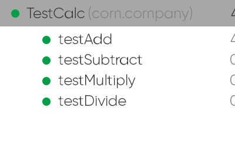

# Exercise 4.1
## Chapter 3 contained the program Calc.java. It is available on the program listings page on the book website. Calc currently implements one function: it adds two integers. Use test-driven design to add additional functionality to subtract two integers, multiply two integers, and divide two integers. First create a failing test for one of the new functionalities, modify the class until the test passes, then perform any refactoring needed. Repeat until all of the required functionality has been added to your new version of Calc, and all tests pass. Remember that in TDD, the tests determine the requirements. This means you must encode decisions such as whether the division method returns an integer or a floating point number in automated tests before modifying the software.Submit printouts of all tests, your final version of Calc, and a screenshot showing that all tests pass. Most importantly, include a narrative describing each TDD test created, the changes needed to make it pass, and any refactoring that was necessary.

### Calc.java

```java
package com.company;

public class Calc {
    static public int add(int a, int b) {
        return a + b;
    }

    static public int subtract(int a, int b) {
        return a - b;
    }

    static public int multiply(int a, int b) {
        return a * b;
    }

    static public double divide (int a, int b)
    {
        return (float) a/b;
    }
}
```

### TestCalc.java

```java
package com.company;

import org.junit.Test;
import static org.junit.Assert.*;

public class TestCalc {
    Calc calc = new Calc();
    private int a = 6;
    private int b = 3;

    @Test
    public void testAdd() {
        assertEquals(calc.add(a, b), 9);
    }

    @Test
    public void testsubtract() {
        assertEquals(calc.subtract(a, b), 3);
    }

    @Test
    public void testMultiply() {
        assertEquals(calc.multiply(a, b), 18);
    }

    @Test
    public void testDivide() {
        assertEquals(calc.divide(a, b), 2, 0);
    }
}
```

### Image:

